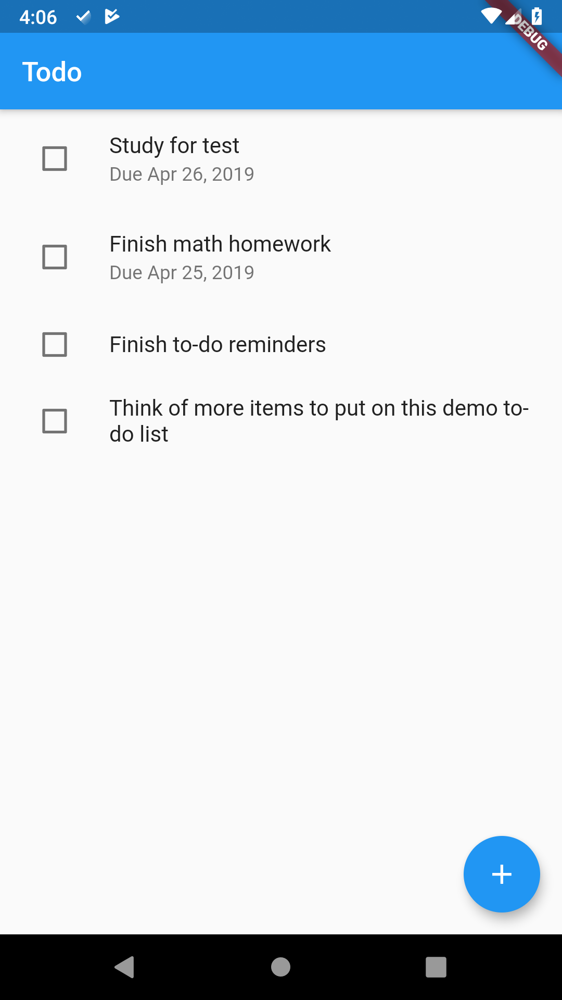

# todo

Simple to-do list app for Android.

## Features
- Add to-do list items with the floating action button
- Edit items by long-pressing on them
- Delete items by swiping them away
- Since this is made with Flutter, it may support iOS too, but I don't have an iPhone so I can't check

## Screenshot

## Download
[Android APK download - install at your own risk](https://github.com/dkter/todo/releases/download/1.0/todo.apk)
